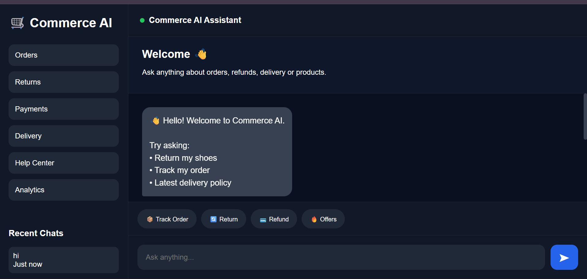
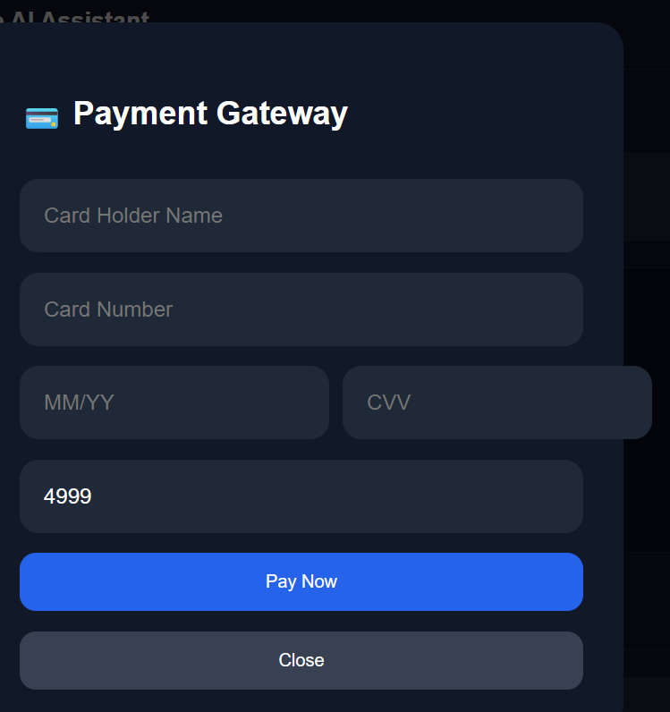
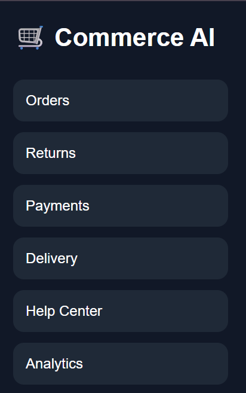
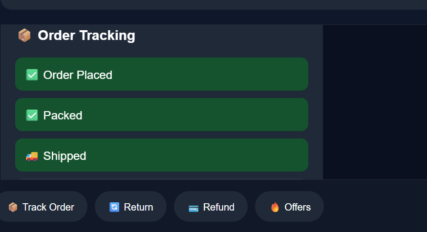

# Commerce AI Assistant

An AI-powered ecommerce customer support chatbot built using:

- LangGraph
- LangChain
- Flask
- FAISS
- Hybrid Retrieval (BM25 + Vector Search)
- Groq LLM
- Streaming Responses

---

# Problem Statement

Modern ecommerce platforms require fast and intelligent customer support systems capable of handling:

- Refunds
- Returns
- Order Tracking
- Payments
- Delivery Queries
- Latest Policies

Traditional chatbots fail to provide contextual and intelligent responses.

This project solves that problem using AI-powered retrieval and web search routing.

---

# Features

- AI customer support chatbot
- Streaming responses like ChatGPT
- RAG-based retrieval
- Hybrid search (BM25 + FAISS)
- Web search routing
- Dynamic chat history
- Suggested replies
- Product cards
- Order tracking UI
- Analytics dashboard
- Payment pipeline UI
- Responsive modern frontend

---

# Tech Stack

Frontend:
- HTML
- CSS
- JavaScript

Backend:
- Flask
- LangGraph
- LangChain
- Groq API

Vector Database:
- FAISS

Embedding Model:
- BAAI/bge-small-en-v1.5

---

# Project Structure

commerce_chatbot/
│
├── app.py
├── vectordb/
├── templates/
├── static/
├── src/
│   ├── graph.py
│   ├── retriever.py
│   ├── websearch.py
│   ├── prompts.py
│   ├── memory.py
│   └── utils.py

---

# Setup Instructions

## 1. Clone Repository

git clone <repo_link>

cd commerce_chatbot

---

## 2. Create Virtual Environment

python -m venv .venv

---

## 3. Activate Environment

Windows:

.venv\Scripts\activate

---

## 4. Install Dependencies

pip install -r requirements.txt

---

## 5. Add Environment Variables

Create `.env`

GROQ_API_KEY=your_api_key

---

## 6. Run Application

python app.py

---

# Demo Video

Add your video link here.

---

# Screenshots

## Chat Interface

---
## Payment Pipeline

---

## Sidebar UI

---

## Analytics Dashboard

---

## Order Tracking

# Author

Lagnadeep Samal